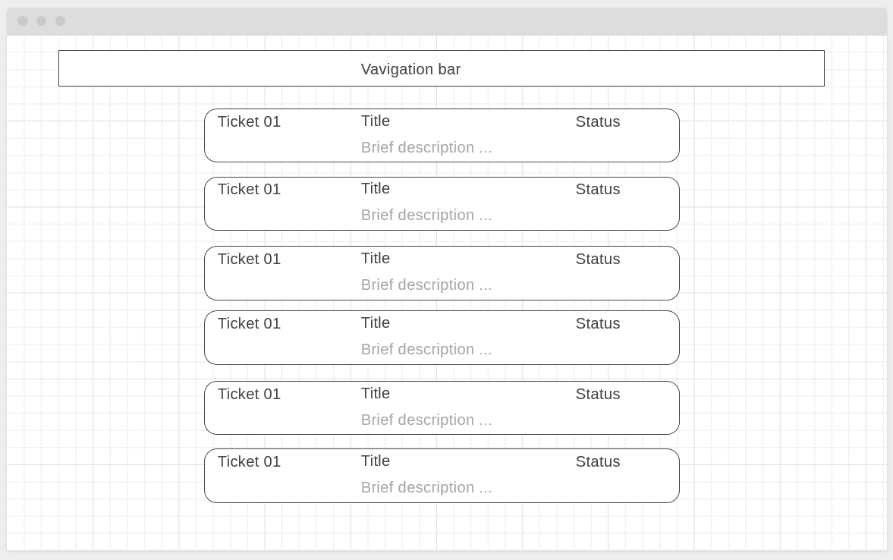
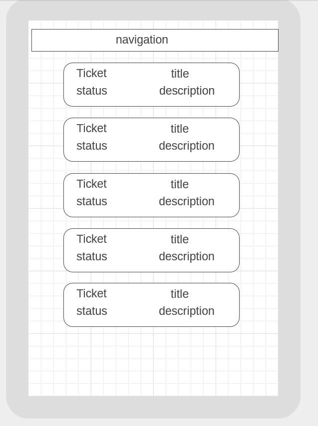
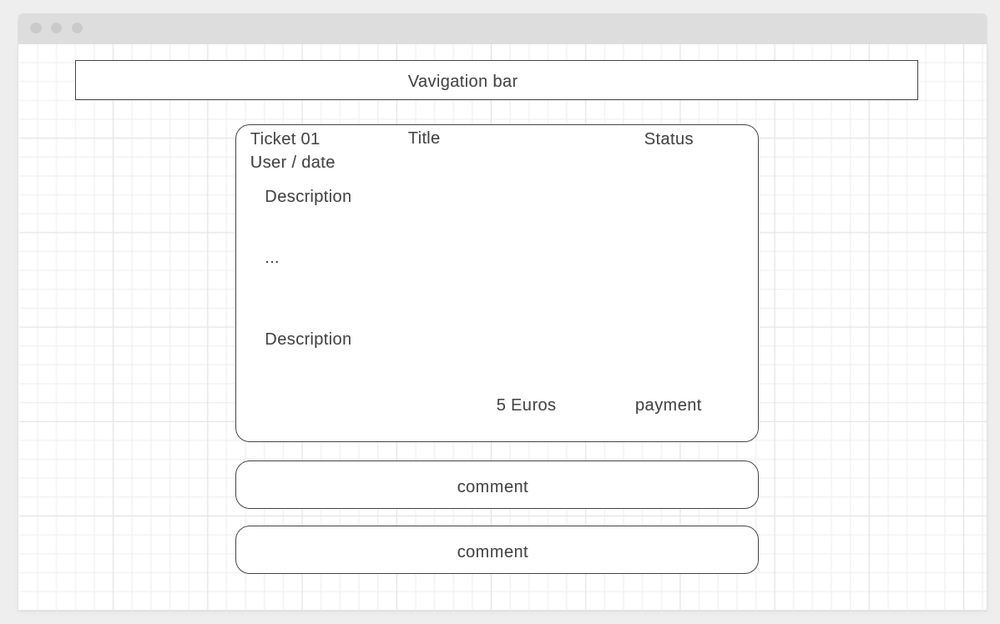
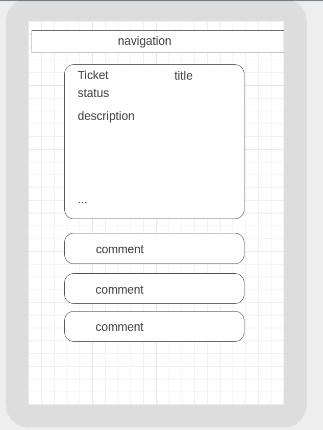

# Milestone project 4
## Issue Tracker

A web application to serve as a ticket system to track issues, help developers and end users to report and fix bugs, suggest and track the development of features. 

Demo application deployed [here](https://issuetrack2019.herokuapp.com/)  

Demo login: (has staff admin rights, '/admin/')
Username: testuser  
Password: testpass1  

## UX

### Wireframes: 

### User stories:

- A user can view the tickets list on the home page, can view the details of every ticket, the comments, can make payment.
- A user can create an account. 
- An authenticated user can create a ticket of a Bug or feature type, comment, vote, pay for features.
- When a feature ticket is created, a superuser will add a target budget for the funding.
- Users can pay a minimum amount and above for a feature, when the target is reached, the feature can start being implemented.
- A ticket status to indicate: in progress, completed, pending, awiting quote.
- Display balance between the target funding and funds collected so far for each feature.

## Features

### Existing Features

- User authentication
- User dashboard
- List view of all tickets
- Search, results filtering
- Detail view 
- Commenting
- Voting
- Contact messaging
- Cart
- Checkout
- Payment using Stripe
- Continuous integration with Travic Ci

### Features left to implement

- Blog
- Detailed progress page
- Various charts on activity and progress
- Write more automated tests

## Technologies used

- HTML5, CSS3, Bootstrap
- Javascript
- Python language
- Django framework
- Postgres database system
- Django crispy forms
- Heroku to deploy a Demo app
- Environ to manage environments
- Whitenoise
- Stripe
- Travis Ci

## Testing

- HTML and CSS was validated using W3 tool
- The web application was tested on different screen sizes and mobile
- A number of automated tests were implemeneted using Django testing module to test models, forms, views.
- the automated tests run during the continuous integration with Travis Ci 
- Manual testing was caried out to test all routes and functionalities expected in the user stories as follows:
- Search on the home page with all the combinations.
- Create a new ticket without being authenticated.
- Ssend a message without authentication
- Vote without authentication
- Commenting without authentication
- Checkout without authentication.
- Register new user with an already existing username
- Register new user with an already existing email
- Login with invalid credentials
- Vote when logged in, then tested the total number of votes displayed in the list view
- Posting few comments then tested the number of comments for each ticket in the list view
- Updating a ticket, tested changing the type from bug o feature and vice versa
- Deleting a ticket, tested the search results and list view 
- Adding an amount to the cart, with more than one ticket.
- Updating the cart amounts, deleting tickets from the cart
- Checkout, payment confirmation
- Tested if the funding balance and target is correct
- Updating the feature price from the admin

## Deployment

- Clone the repository
- Start a virtual environement with pipenv
- Install dependencies with 'pipenv install'
- Initiate a git local repository
- For local testing and development, create .env file and include values for these variables: SECRET_KEY, DEBUG, STRIPE_SECRET,     STRIPE_PUBLISHABLE, DATABASE_URL
- Create accounts for Heroku, Stripe
- Create an app in heroku and add postgres addon, DATABASE_URL will be automatically added to the environment varibales. [help](https://devcenter.heroku.com/articles/git)
- In Heroku settings add environement variables for: SECRET_KEY, DEBUG, STRIPE_SECRET, STRIPE_PUBLISHABLE
- In command line execute the folling commands:  
$ heroku git:remote -a "your_app_name"  
$ git push heroku master  
$ heroku run python manage.py makemigrations  
$ heroku run python manage.py migrate  
$ heroku run python manage.py createsuperuser  
$ heroku run python manage.py collectstatic  

## Credits

- Code Institute Material
- Snippets of code from Code Institute Material, especially the shopping cart module and integration with Stripe.
- The book "Practical Django 2 and Channels 2" by Federico Marani

### Design

Rafocus
